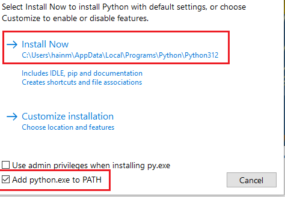
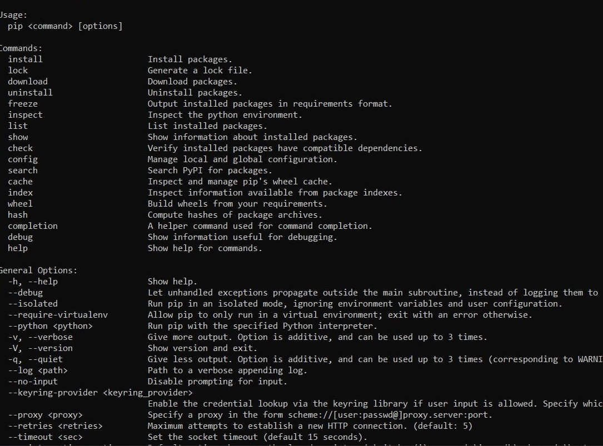
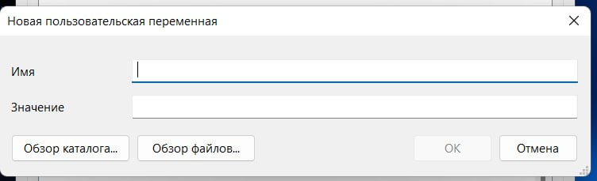

# How install python on PC
## by [@Hidlow](https://t.me/hidlow)

**если у вас `windows 10-11`, 64-32х то устанавливаем `python 3.13.`**

**для `64х` - [click](https://www.python.org/ftp/python/3.13.0/python-3.13.0-amd64.exe)**

**для `32х` - [click](https://www.python.org/ftp/python/3.13.0/python-3.13.0.exe)**

**P.S все ссылки из [официального сайта](https://www.python.org/). Eсли нужна другая версия под вашу ос, то скачивать оттуда**

***
**когда все скачали запускаем установщик —> жмем ``install now`` и обязательно ставим галочку в поле с `PATH`, пример:
**


**после того как все установилось, проверяем версию и `pip`.  `win+r —> cmd` далее вписываем данные команды:**
```
py --version
```
**Эта команда выведет `версию python`, если вы получили ``Python 3.13.2`` - все в норме**

**Команда вызова также может быть и ``python --version``, но так как мы устанавливали через ``лаунчер``, вызываем через `py`**

## pip

**Eсли все правильно установилось то должно вывестись меню:**


**Если вы получили сообщение о том, что `pip не является внутренней или внешней командой`, то значит вы `не поставили галочку в поле PATH в установщике`. Следующие действия:**

**Ищем примерное местонахождение файла `pip`, по умолчанию он всегда лежит в `C:\Users\ИМЯ\AppData\Local\Programs\Python\Python313\Scripts`**

**Далее копируем этот путь и нажимаем на ярлык `этот компьютер —> свойства —> дополнительные параметры системы —> переменные среды —> Создать`**

**далее у вас будет `2 поля`:** 



в поле `Имя` пишем `Path`, а в значение указываем `путь, который скопировали`. Нажимаем `ОК` и теперь перезапускаем `cmd` и заново пишем `pip`
